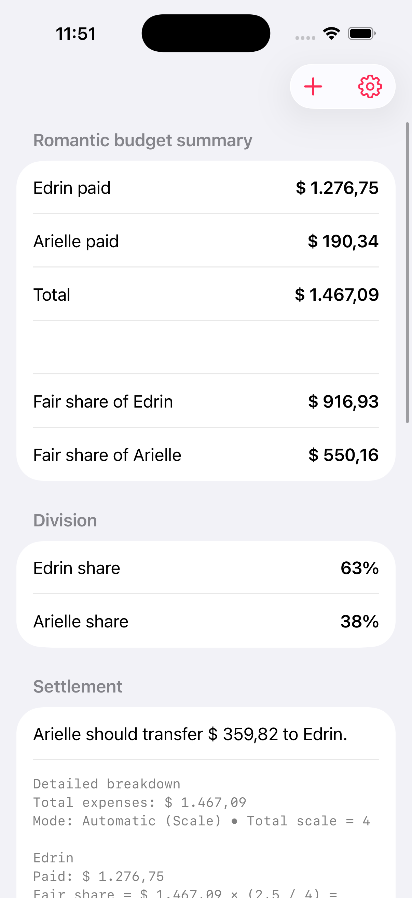
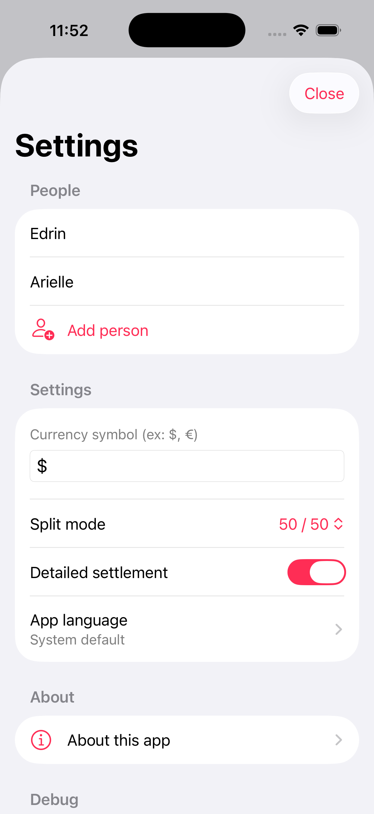
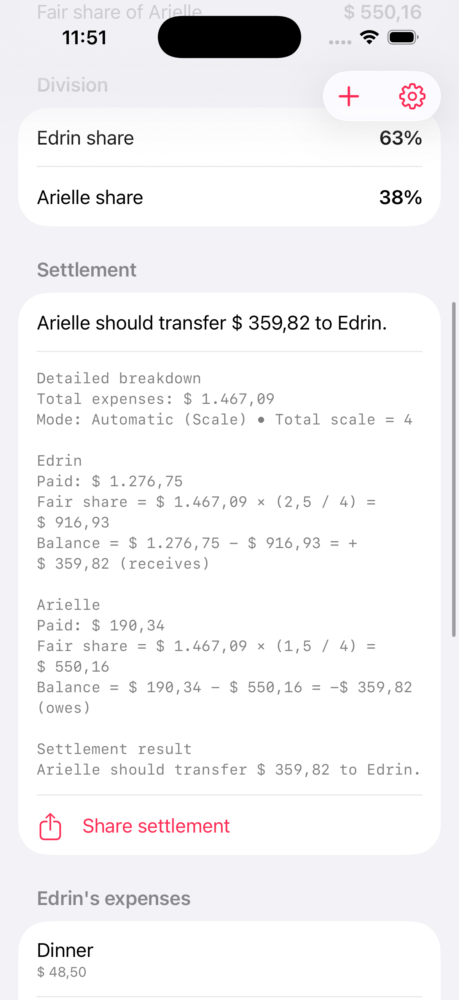
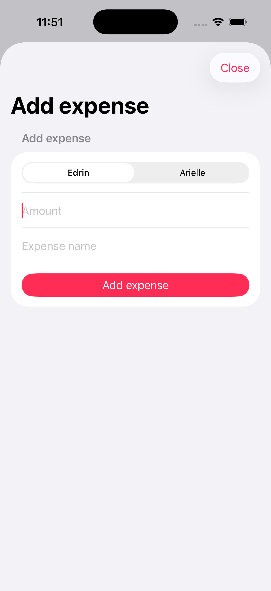

# Amor&Contas

Amor&Contas is an iOS app 💖 to organize shared expenses in a simple, transparent, and fair way.

It allows you to register expenses by person, choose the split mode, and generate a ready-to-share settlement message 📤.

---

## Overview ✨

- 👥 Multi-person support
- 🧾 Expense tracking per person
- ⚖️ Two split modes: `50 / 50` and `Automatic (Scale)`
- 📊 Fair-share calculation for each person
- 📤 Settlement summary with share option

---

## How the app works 🚀

### 1) Configure people 👤
In the settings menu, you can edit names, add people, and adjust app preferences.

### 2) Choose the split mode ⚖️

- **50 / 50**: splits equally among everyone.
- **Automatic (Scale)**: splits proportionally based on scale values.

Tip 💡: use net income as scale so the financial burden is more balanced across people.

### 3) Register expenses and review settlement 🧾
Add expenses indicating who paid, see the total paid by each person, and check the final settlement.

When there are only 2 people, the app directly shows who pays how much to whom 💸.

---

## Feature structure 🧩

- **Main summary**: paid totals, overall total, and fair share per person.
- **Division**: participation percentage for each person.
- **Settlement**: final transfer/adjustment message.
- **Expenses list**: expenses grouped by person, with swipe-to-delete.
- **Settings**: people, currency, split mode, scales, income, and About area.

---

## Technologies 🛠️

- Swift
- SwiftUI
- Local JSON persistence (Documents)
